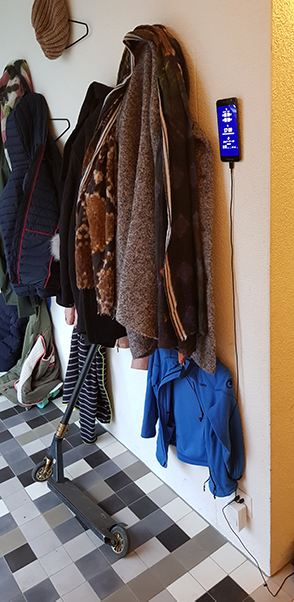
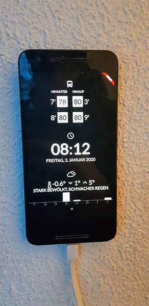
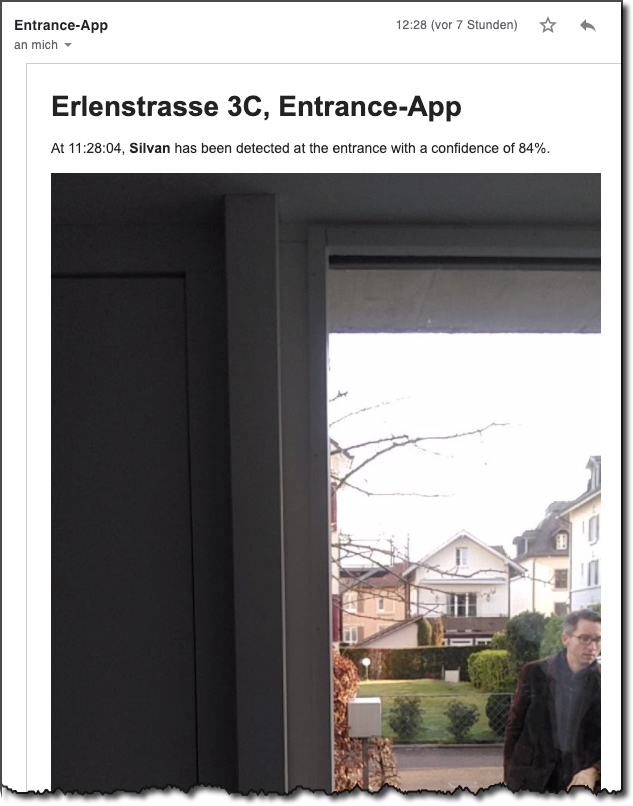
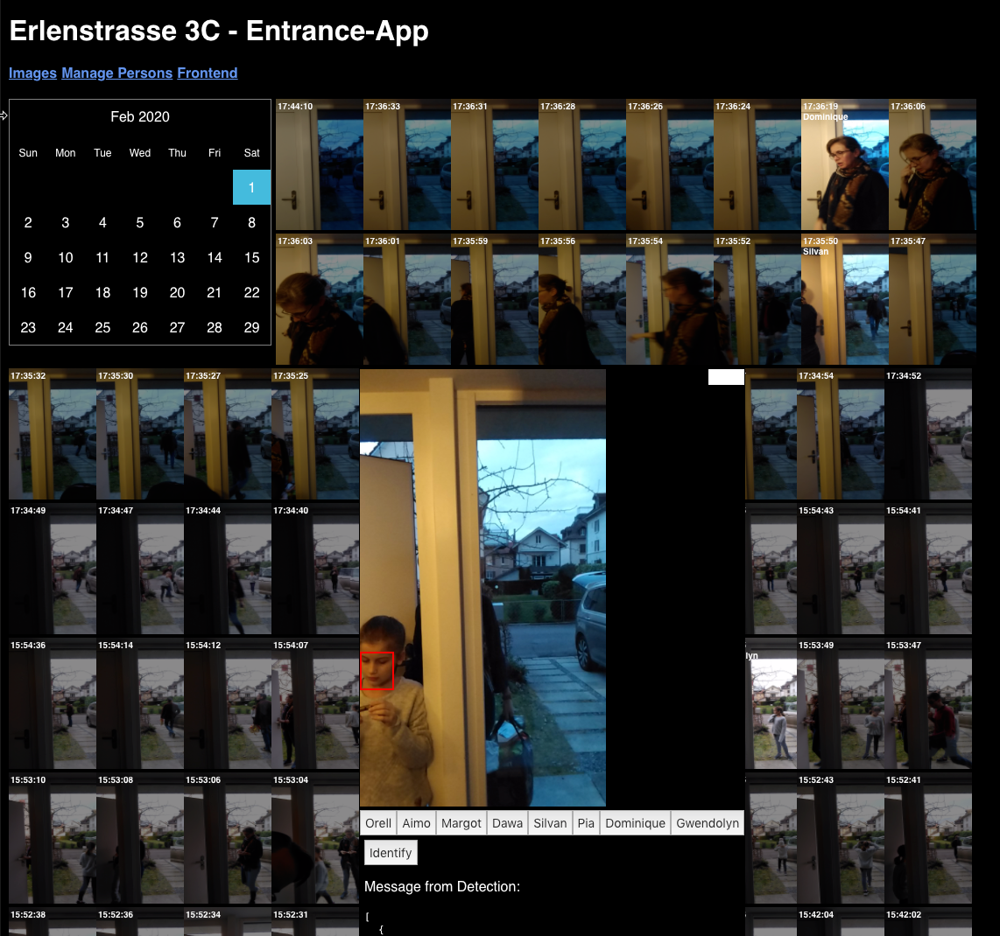
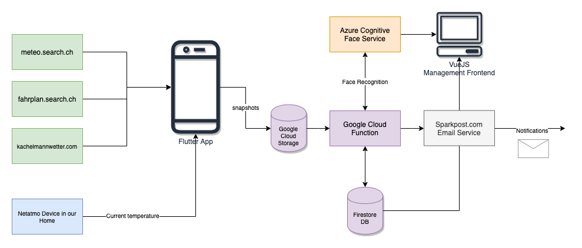

# Entrance-Screen - A info-screen with face recognition

Combining an evaluation of Flutter, Google ML Kit, Azure Face Recognition with
a useful gadget for our house: A app which tells me everything I need to know
before I leave the house. And it recognizes who is entering the house.

Following my tradition of recycling old
smartphones. This time a Huawei Nexus 6P.

[Click here for Web-version of the app](https://entrancescreen.firebaseapp.com/flutter)

 

## Info-screen

Highly customized screen for the entrance of our house:

- Know when to hurry up: the next departures of the bus next to our house
- Know if you'll be late for the meeting: the current time and date
- Know what to wear: the temperature outside the house using the Netatmo sensors and API and the
  forecasted temperature and current weather coming from http://meteo.search.ch
- Know whether I need to take the rain gear with me: Rain forecast scraped from
  https://kachelmannwetter.com

Additional feature:
- if the light sensor reports darkness, the display turns off. Reason: The screen can be seen
  through the window. We don't want to attract curious people during the night

## Face reconization feature

As the front-facing camera is pointing right to our porch I am using it to continuously
monitor it for known faces: If someone is detected, it notifies me via email.

 
A management interface allows to add new people and classify faces:

  

## Architecture

- The app uses the Google ML kit to detect faces on the device
- The image is uploaded to Google Cloud Storage
- A cloud function is triggered which sends the image to the 
  [Azure Cognitive Face Service](https://azure.microsoft.com/en-us/services/cognitive-services/face/).
- The result of the detection is stored in Firebase Database
- A VueJS frontend allows to 
  - see the detected pictures
  - add new persons
  - add new faces to the persons
  
